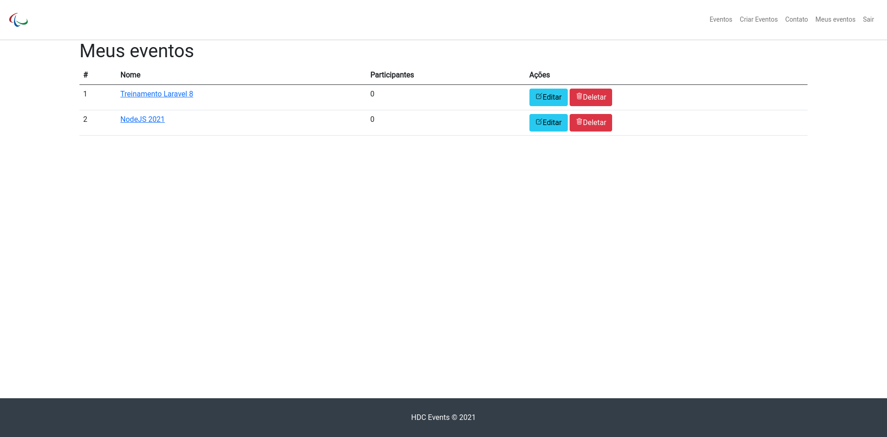

# HDC Events

Sistema de gerenciamento de eventos feito com PHP/Laravel sob o curso ministrado por [@matheusbattisti](https://github.com/matheusbattisti).

O sistema ainda está em desenvolvimento, por isso algumas alterações de layout e prints devem acontecer.

-   PHP 8.0
-   Sistema de login com o Laravel / Jetstream
-   Layout baseado em Bootstrap 4
-   Banco de dados testado com SQLite3
-   Utilizado o próprio servidor de aplicação do PHP

---

## Screenshots:

### Página Inicial com eventos cadastrados

### Página de Dashboard

### View de criação e edição de eventos

### Login

